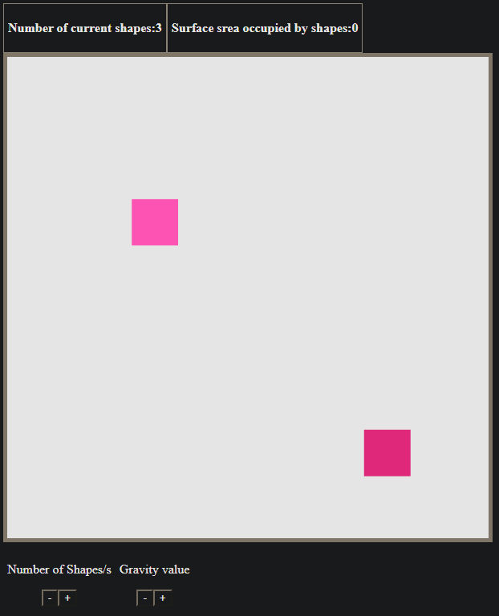

# CandyWebgl
This is a small game/project created with WebGl.

## Instalation

1. Check if your [Node.js](https://nodejs.org/) version is >= **14**.
2. Clone this repository.
3. Run `npm install -g serve --save`.
4. Run `serve -p 5555`
5. Access `http://localhost:5555`

